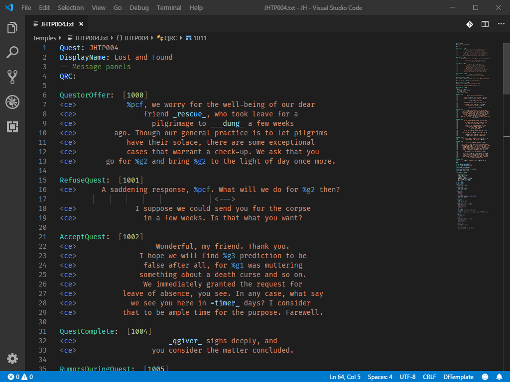
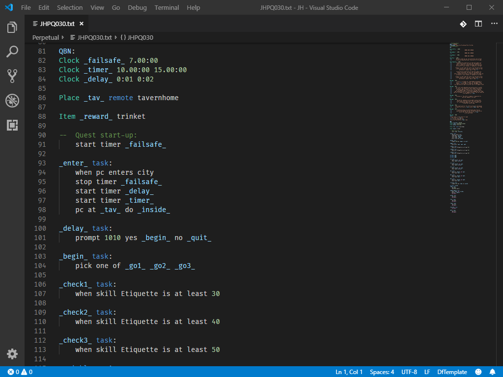

# Daggerfall Unity Quest Script for Visual Studio Code

A Visual Studio Code extension with support for quest scripting language used by [Daggerfall Unity](https://github.com/Interkarma/daggerfall-unity), which is based on Donald Tipton's [_TEMPLATE 1.11_ language](http://www.dfworkshop.net/static_files/questing-source-docs.html) for Daggerfall.

```dftemplate
Place _building_ remote house2

log 1010 step 0

_playerArrived_ task:
    pc at _building_ set _showResult_

_showResult_ task:
    say 1050
    remove log step 0
    end quest
```

## Quick start

1. Download the latest version from [Releases](https://github.com/TheLacus/vscode-dftemplate/releases). Open the command palette (**View > Command Palette** or `Ctrl+Shift+P`), type **_Extensions: Install from VSIX_** and select the downloaded file.
2. Open the folder with your quests, then from **File > Preferences > Settings > Workspace Settings** search `files.associations` to associate the language to text files inside the folder.

    ```json
    "files.associations": {
        "*.txt": "dftemplate"
    }
    ```

    Daggerfall Unity quest files use .txt extension, but is possible to use glob patterns to target only a subsection of files.

3. When you open a quest file for the first time you will be asked to select the folder _StreamingAssets/Tables_. Alternatively, manually set `dftemplate.tablesPath`.

## Features

* Syntax and semantic highlighting.
* Hovers with informations for symbols and completion proposals.
* Go to definition/references.
* Diagnostics, quick fixes and other actions.

### Commands and settings

| Command | Description |
| --- | --- |
| `DFTemplate: Toggle center token` | Switch between left and centered alignment for the selected message. |
| `DFTemplate: Generate messages` | Propose a list of static messages which are not defined inside current quest. |
| `DFTemplate: Order messages` | Reposition messages inside the QRC block according to numeric id. |
| `DFTemplate: Generate global variables` | Propose a list of global variables which are not defined inside current quest. |
| `Format Document` | Format code using the formatter provided by this extension. |

To configure the behaviour of this extension, open the [user or workspace settings](https://code.visualstudio.com/docs/getstarted/settings) and type ```DFTemplate```.

### Documentation comments

A comment block above any quest or resource declaration is parsed as a documentation for it and shown inside tooltips. Markdown syntax is supported.

```
-- Example quest to freely spawn multiple foes inside a dungeon environment.
-- Player will be teleported automatically to target dungeon.
Quest: __DEMO13
```

## Language Data

### Tables

Quest data tables are read from local installation of Daggerfall Unity to provide completion suggestions and diagnostics features. If the workspace root path is not is not a subfolder of _StreamingAssets_, the absolute or relative path to _StreamingAssets/Tables_ must be set with **dftemplate.tablesPath**.

### Modules

Modules are json files that provides signatures and documentation for actions, conditions and other modular language data. Standard actions are already included with this extension but additional modules can be imported from a folder named **Modules** in the workspace root directory, when their names are added to **dftemplate.modules**. For example `"Mods/Example"` makes data available from `/Modules/Mods/Example.dfmodule.json`. New module files can be easily created following the associated json schema.

-----------------------------------------------------------------------------------------------------------




